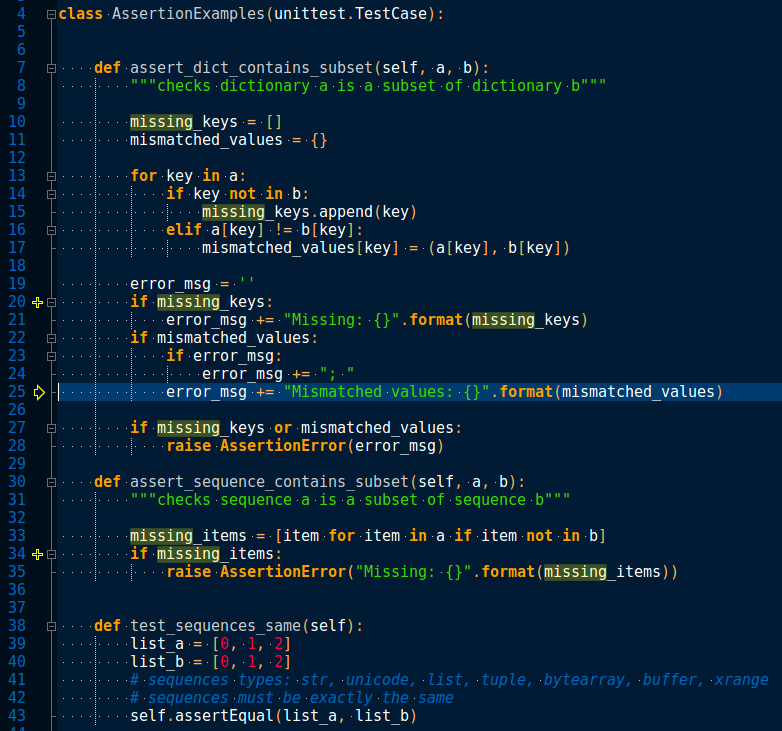

# geany-cobalt-theme

Quick port of Will Farrington's gedit Cobalt theme to Geany.

## Installation

Copy `cobalt.conf` to `~/.config/geany/colorschemes/.`

## Lagniappe

**Format > Send Selection to > Set Custom Commands**

JSON Pretty Print `python -m json.tool`

XML Pretty Print `xmllint --format -` or `python -c 'import sys;import xml.dom.minidom;s=sys.stdin.read();print xml.dom.minidom.parseString(s).toprettyxml()'`

Sort Lines `sort`

Sort Lines and Remove Duplicates `sh -c 'sort | uniq'`

Remove CR and LF `tr -d '\r\n'`
